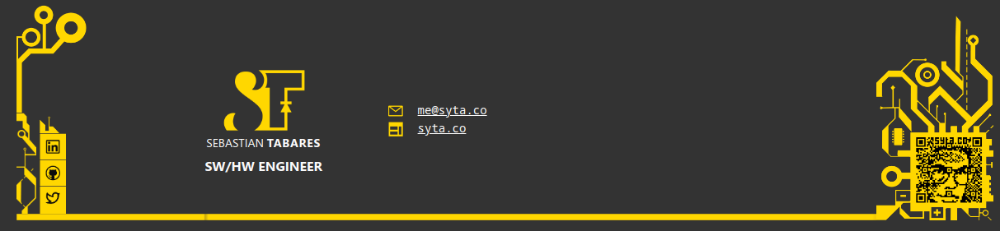
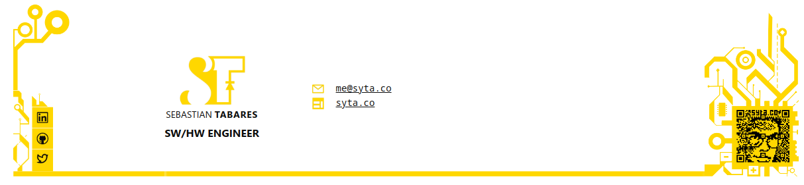

<div align="center">
  <p>
    <a href="https://maizzle.com" target="_blank">
      <picture>
        <source media="(prefers-color-scheme: dark)" srcset="https://github.com/sytabaresa/personal-signature/raw/master/src/images/logo-short.png">
        
      </picture>
    </a>
  </p>
  <p>Personal Signature of <strong>Sebastian Tabares</strong> (<a href="https://syta.co">syta.co</a>) made with Maizzle</p>
<div>

  [![License][license-shield]][license]

  </div>
</div>

## Visuals

All are screenshots in real devices/email clients:
### Desktop:

#### Outlook Mail Web application with dark theme:

#### Yahoo Web App:


### Mobile:
<table>
<tr>
<td>
<h4>Outlook Android App with dark theme</h4>

</td>
<td>
<h4>Gmail Android App with light theme</h4>

</td>
</tr>
</table>
## Getting Started

Install dependencies:

```
cd my-project

npm install
```

Start local development:

```
npm run dev
```

Build emails for production:

```
npm run build
```

## Documentation

Maizzle documentation is available at https://maizzle.com

## License

This is open-sourced software licensed under the [GPLv3 license](https://opensource.org/licenses/gpl-license).

[npm]: https://www.npmjs.com/package/@maizzle/framework
[npm-stats]: https://npm-stat.com/charts.html?package=%40maizzle%2Fframework&from=2019-03-27
[npm-version-shield]: https://img.shields.io/npm/v/@maizzle/framework.svg
[npm-stats-shield]: https://img.shields.io/npm/dt/@maizzle/framework.svg?color=6875f5
[github-ci]: https://github.com/maizzle/framework/actions
[github-ci-shield]: https://github.com/maizzle/framework/actions/workflows/nodejs.yml/badge.svg
[license]: ./LICENSE
[license-shield]: https://img.shields.io/badge/license-GPL-blue
